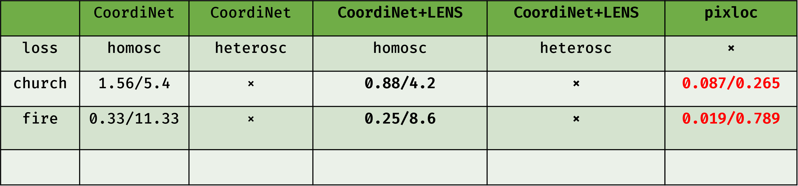
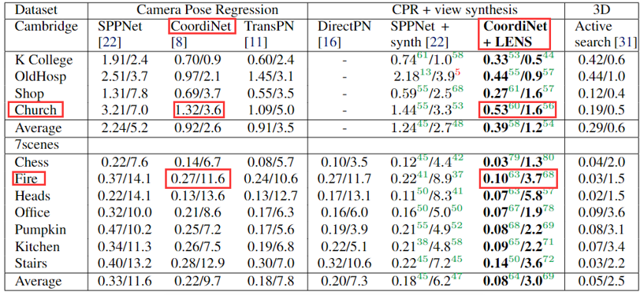

# Coordinet-Pytorch

This is a re-implementation
of [《CoordiNet: uncertainty-aware pose regressor for reliable vehicle localization》](https://arxiv.org/pdf/2103.10796.pdf)
in pytorch.

More visual localization methods: [awesome-visual-localization](https://github.com/awesome-NeRF/awesome-NeRF).

~~hint: the Evaluation Performance is a little bit worse than the original paper. ~~

## environments

- python 3.8.10
  single gpu like RTX3080 is enough

## datasets

### Cambridge

6 scenes: KingsCollege, OldHospital, ShopFacade, StMarysChurch, Street, GreatCourt.
link: [Cambridge Landmarks](https://mi.eng.cam.ac.uk/projects/relocalisation/#dataset)

### 7 scenes

7 scenes: Fire, Heads, Office, Pumpkin, Redkitchen, Stairs, Storage.
link: [7 scenes](https://www.microsoft.com/en-us/research/project/rgb-d-dataset-7-scenes/)

### tips

- torch dataset class: splitting out the train and test images set paths is enough, along with the 3×4 poses.
- addition: referring to [《LENS: Localization enhanced by NeRF synthesis》](https://arxiv.org/pdf/2110.06558.pdf), I use
  nerf-w
  model to synthesize novel views for enhanced training that `synthesis_split.txt`, the nerf-w project is [here]()

## training

example:

```shell
python train_coordinet.py \
--root_dir ./runs/coordinet --exp_name exp \

--batch_size 10 --epochs 250 --lr 0.0001 \
--save_freq 100 --log_freq 1 \
--last_epoch 0 --ckpt_path  \ 

--data_root_dir $DATA_ROOT_DIR --scene &SCENE_NAME \
--reshape_size 320 --crop_size 300 \

--fixed_weight False --learn_beta True --loss_type homosc 
```

- `learn_beta`: coefficient of the geometric loss for the 4 losses:(Tx,Ty,Tz,R), beta means log(σ²), whether to learn
  the beta parameter
  in the loss function, refer
  to [《Geometric Loss Functions for Camera Pose Regression with Deep Learning》](https://arxiv.org/pdf/1704.00390)
- `loss_type`
    - 'homosc': homoscedastic loss, enable `learn_beta` to learn the beta parameter or use a simple accumulated loss of
      t, R.
    - 'heterosc': heteroscedastic loss, uncertainty loss proposed in the paper, you should also set `var_min` of the 4
      losses in order to avoid inf value.
- `fixed_weight`: fix the weight of the efficientnet backbone or not.
- to resume: set `last_epoch`>0 and `ckpt_path` to resume training.
- default I use efficientnet-b3 as the backbone and use 'homosc' loss.

## results

some results comparison with the original paper:

<div style="text-align:center;">
  
  <p>my coordinet</p>
  
  <p>gt</p>
</div>

comment:
- I didn't pay a lot energey to carefully finetune the parameters。 And, these end to end deep learning methods using models like cnns, transformers, etc. are not as good as the traditional ways like hscnet, pixloc, etc. in terms of accuracy, stability, and robustness. But, they are more efficient and easier to use. 
- Essentially, coordinet and similar end-to-end deep learning methods rely on the training set to establish an interpolation function for pose estimation. Therefore, it greatly depends on the generalization and distribution of the train set.


## attentions

- This project doesn't implement the latter EKF part, just finish pose regressor network.
